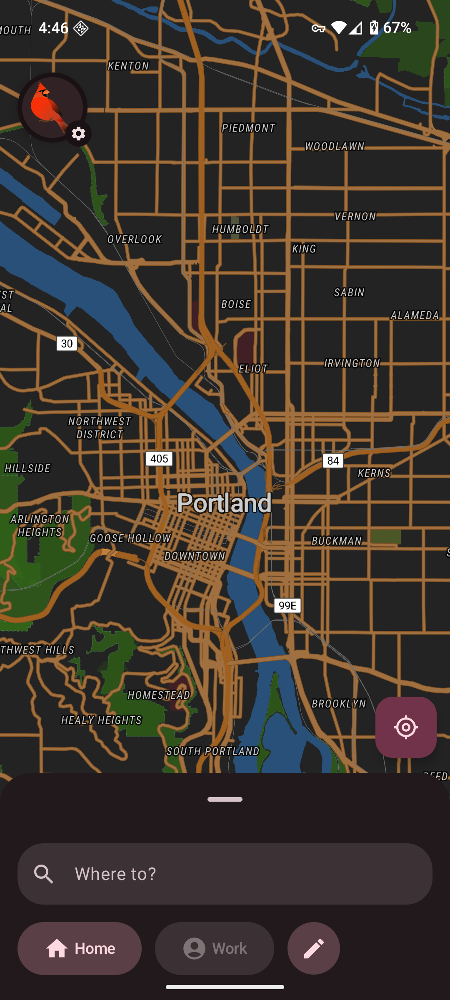
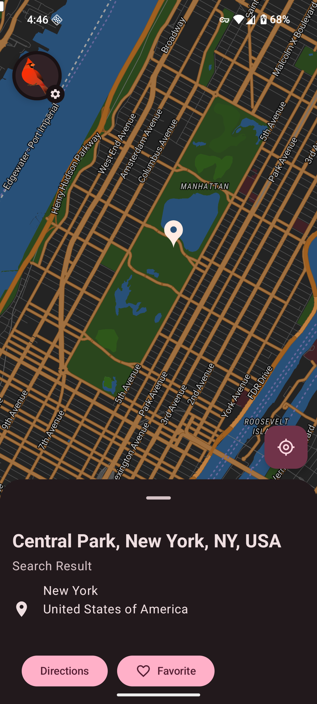
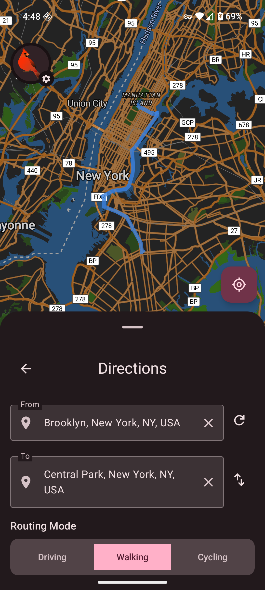

<a href="https://apps.obtainium.imranr.dev/redirect?r=obtainium://app/%7B%22id%22%3A%22com.murena.maps%22%2C%22url%22%3A%22https%3A%2F%2Fgitlab.e.foundation%2Fe%2Fos%2Fmaps%22%2C%22author%22%3A%22e%22%2C%22name%22%3A%22Murena%20Maps%22%2C%22preferredApkIndex%22%3A1%2C%22additionalSettings%22%3A%22%7B%5C%22fallbackToOlderReleases%5C%22%3Atrue%2C%5C%22trackOnly%5C%22%3Afalse%2C%5C%22versionExtractionRegEx%5C%22%3A%5C%22%5C%22%2C%5C%22matchGroupToUse%5C%22%3A%5C%22%5C%22%2C%5C%22versionDetection%5C%22%3Afalse%2C%5C%22releaseDateAsVersion%5C%22%3Afalse%2C%5C%22useVersionCodeAsOSVersion%5C%22%3Afalse%2C%5C%22apkFilterRegEx%5C%22%3A%5C%22%5C%22%2C%5C%22invertAPKFilter%5C%22%3Afalse%2C%5C%22autoApkFilterByArch%5C%22%3Atrue%2C%5C%22appName%5C%22%3A%5C%22Murena%20Maps%5C%22%2C%5C%22appAuthor%5C%22%3A%5C%22E%20Foundation%5C%22%2C%5C%22shizukuPretendToBeGooglePlay%5C%22%3Afalse%2C%5C%22allowInsecure%5C%22%3Afalse%2C%5C%22exemptFromBackgroundUpdates%5C%22%3Afalse%2C%5C%22skipUpdateNotifications%5C%22%3Afalse%2C%5C%22about%5C%22%3A%5C%22%5C%22%2C%5C%22refreshBeforeDownload%5C%22%3Afalse%7D%22%2C%22overrideSource%22%3A%22GitLab%22%7D" class="img-badge">
    
</a>

# Murena Maps

> 💡 Development status: This app is in active development. **Features and behavior may change, updates may introduce regressions or data loss, and the service is provided without warranty.**

Murena Maps is a mapping application for Android designed to get out of your way and be there when you need it. We believe maps should be fast, private, and focused on what matters most—helping you navigate the world around you.

## Key Features

Every decision we make puts the user first:

- **No tracking or analytics** - Your data stays yours
- **Online and offline modes** - Search and get directions anywhere in the world out of the box, with complete offline privacy just a few taps away.
- **Self-host your maps services** - Works seamlessly with [Headway](https://github.com/headwaymaps/headway) for those who want the convenience of online maps on their own terms.
- **Modern look and feel** - Built from the ground up with Material 3 components.
- **Smooth performance** - Using MapLibre for map rendering means Murena Maps is fast—much faster than you may be used if you're a FOSS maps enjoyer.
- **Transit support (work in progress)** - Easily view departures at nearby transit stations.

## Screenshots

## License

This project is licensed under the GNU General Public License, version 3—see the [LICENSE.md](LICENSE.md) file for details.

## Contact

For questions, suggestions, or support, please open an issue on our GitHub repository.

---

## Kapijuja Nav fork — current engineering state

This repository is the **canonical Kapijuja Nav line**. It is based on Murena Maps/Cardinal and keeps the upstream application architecture instead of replacing the navigation stack.

### Canonical source and verified baseline

- Canonical repository: `standartkiev-pixel/kapijuja-nav-osm-murena`
- Canonical branch: `main`
- Official upstream imported from: `https://gitlab.e.foundation/e/os/maps`
- Pinned upstream commit: `f9a061aff58ec7f11dc7fa19bd0138720fc99b01`
- Kapijuja clean import commit: `0adf78dd4801e71494f1dc5001734589dc025069`
- Current documented functional main: `de51ac7fd93083914c316510cd449096e4022ae2`
- Green GitHub Actions build: run `33834518093`
- Final ARM64 artifact: `Kapijuja-Murena-Final-arm64-debug` (artifact ID `9923120947`)
- The user has reported the current device build as stable in normal use, with no observed crashes.

The stock Murena baseline remains the regression reference. Prefer high-level Kotlin/ViewModel/repository/request-layer changes. Do not modify MapLibre, Ferrostar internals, native Valhalla, or the Rust geocoder unless evidence proves a lower-level change is required.

### Navigation stack and data sources

Kapijuja keeps the upstream stack:

- **MapLibre** for map rendering.
- **Ferrostar** for turn-by-turn navigation state, maneuver guidance and navigation controller behavior.
- **Valhalla** for routing.
- **Pelias / upstream geocoding path** for online search when configured.
- **Rust/UniFFI geocoder** for local/offline geocoding.
- **OpenStreetMap-derived graph/map data** in the Murena/Cardinal pipeline.
- **Stadia hosted Valhalla** when the user supplies a Stadia key in Advanced Settings.
- Existing offline-area downloads contain three logical stages: basemap, Valhalla routing graph tiles and offline-geocoder processing.

The app does **not** require a private Stadia key to be compiled into the APK. A user-provided key can be entered in Advanced Settings. The same configured Valhalla key is used by normal routing and by supported live-traffic routing profiles.

### Truck support

A stock high-level bug was fixed: `RoutingMode.TRUCK` previously fell through to the ordinary car wrapper in Directions. Truck now uses the dedicated Truck Ferrostar wrapper and Truck Valhalla costing.

Built-in Truck baseline:

- length: **16.5 m**
- width: **2.5 m**
- height: **4.0 m**
- weight: **45 t**
- axles: **3**
- `use_truck_route=1.0`
- highway preference enabled
- living streets and tracks strongly avoided
- unpaved roads avoided
- residential/service/low-class roads penalized where Valhalla exposes the corresponding Truck options
- closures, restrictions, access and one-way rules are not globally disabled

For destination correlation, Truck keeps a conservative **100 m** legal-edge candidate radius. Its cautionary access-only dashed final approach remains short (currently capped at roughly **120 m** actual route distance).

### Bus / coach support

A native `RoutingMode.BUS` was added through the existing architecture: routing mode, routing profile persistence, profile editor, Ferrostar wrapper, Valhalla profile selection, Directions selection and turn-by-turn navigation.

Built-in Bus/coach physical baseline:

- length: **13.5 m**
- width: **2.5 m**
- height: **4.0 m**
- weight: **18 t**
- axles: **3**
- highways preferred
- living streets and tracks strongly avoided
- service roads and alleys penalized
- unpaved roads avoided
- closures/restrictions/one-ways remain respected

The visible profile switch is currently called **Car**:

- **Car ON** = Valhalla `auto` access semantics while retaining coach dimensions/weight.
- **Car OFF** = native Valhalla `bus` / PSV access semantics.

The persisted internal field is still called `lineBus` for compatibility and the UI is inverted with `Car = !lineBus`.

**Important next UX correction:** current built-in `BusRoutingOptions` still initializes `lineBus=false`, so the inverted Car switch is effectively ON for a brand-new default Bus profile. The desired future behavior is the opposite: a new/default Bus must start as a real Bus with **Car OFF**. Do this without silently changing existing saved profile values. Also add explanatory UI text such as “Car access rules with bus dimensions” so the switch meaning is unambiguous.

### Bus legal-edge search and dashed final approach

Bus/coach routing now has a larger destination-correlation search than Truck:

- Truck legal-edge search: **100 m**
- Bus / native Bus traffic / coach-Car legal-edge search: **600 m**
- Normal passenger Auto does not receive the Bus heavy-vehicle radius.

The main route is still calculated with the strict heavy-vehicle profile. If the strict route ends on a nearby legal edge instead of the exact requested destination, Kapijuja can add a separately rendered cautionary final approach.

Bus fallback is tiered and tested in order:

1. **Yellow dashed approach — access-only relaxation**
   - uses Auto access semantics with `ignore_access=true`
   - keeps configured length, width, height and weight
   - keeps `ignore_restrictions=false`
   - keeps one-way direction and closures

2. **Orange dashed approach — weight-relaxed**
   - only tried if access-only routing fails
   - effective weight is set to `0.0` for restriction matching
   - keeps configured length, width and height
   - width/height restrictions remain active
   - one-ways and closures remain active

3. **Red dashed approach — weight + length relaxed, last resort**
   - only tried if both earlier tiers fail
   - effective weight and length are set to `0.0`
   - configured **width and height remain enforced**
   - `ignore_restrictions` is still not globally enabled
   - one-ways and closures remain active

The Bus dashed approach is capped at **600 m actual routed distance**, not merely straight-line offset. This is intentionally a driver-warning route, not a claim that the road is legally suitable for a coach.

The route preview and turn-by-turn map carry the fallback geometry and render risk tiers differently so the driver can recognize when the app has left the strict Bus route.

### Live traffic and closures

The real configured Stadia key was safely tested through GitHub Actions without printing it. Premium traffic profiles were confirmed to be accepted for:

- `auto_traffic_premium`
- `bus_traffic_premium`
- `truck_traffic_premium` on a known routable Truck segment

Kapijuja therefore enables traffic for Auto, Truck and Bus/coach when the configured backend/key supports it. Traffic requests use a current departure time. If an eligible traffic profile is rejected as unsupported/unauthorized, the routing layer can fall back to the corresponding non-traffic profile instead of failing the whole route.

Closures are not intentionally bypassed. The project has **not** yet implemented country-specific EU/NAP closure-feed adapters; that remains future work.

### Strict Stadia JSON boundary

Hosted Stadia routing rejected some second-based cost/penalty values when serialized as floating-point JSON (for example `300.0`) even though the UI stores them as `Double`. The API boundary now normalizes the known second-based penalty/cost fields to JSON integers while leaving physical dimensions/weight as numeric vehicle values.

### Routing profile UX

The profile/routing UI was changed at the high layer:

- routing-mode icons stay large and are horizontally scrollable instead of shrinking to fit every mode at once;
- the last selected saved profile is remembered per routing mode;
- if saved profiles exist for a mode, the synthetic/fake Default Profile choice is not shown;
- if no saved profile exists, built-in defaults are used silently;
- multiple saved profiles remain supported.

### API settings

Advanced Settings exposes the routing/geocoding configuration. Kapijuja no longer needs the private project Stadia key embedded in the APK.

- user can enter a Stadia key manually;
- entering the key selects the Stadia endpoint where appropriate;
- **Reset API settings to defaults** removes user URL/key overrides and restores the same no-key defaults used by a fresh installation;
- do not commit private API keys to this repository.

### Return to Guidance

During active navigation, if the driver manually moves/browses the map and then stops interacting, the app returns to the normal Guidance/tracking camera after approximately **15 seconds**.

- only active when a route exists;
- touching the map suspends/restarts the countdown;
- without a route, no forced recenter is performed.

### APK update/install behavior

The CI debug application now uses a stable dedicated Kapijuja debug signing identity and a monotonically increasing GitHub Actions `versionCode`. This is intended to allow later test APKs to update the same installed debug app instead of requiring an uninstall every time.

A one-time clean install may still be required when migrating from an older APK that was signed with an ephemeral/different debug key.

### Offline Europe country downloads

The Offline Areas screen now includes:

`Offline Areas -> Europe -> country -> Download entire country`

The selected country is passed into the existing Murena offline pipeline, so a completed area is intended to include:

1. basemap tiles;
2. Valhalla routing graph tiles;
3. offline geocoder processing.

The original current-viewport area downloader is retained as a secondary/diagnostic option.

The present country catalog uses practical **bounding rectangles**, not exact border polygons. Physical payload deduplication for overlapping neighboring-country downloads is **not yet considered finished** because the stock storage/accounting is still area-oriented. Exact polygon masks, shared-tile reference accounting and large-country optimization remain future offline work.

### Known deferred work

- Change **new/default Bus** semantics to native Bus / **Car OFF** while preserving existing saved profile values.
- Add a concise explanatory label beneath the Car switch: Car means passenger-car access rules with Bus dimensions retained.
- Continue device testing of narrow residential roads versus suitable arterial roads.
- Decide whether the dashed access approach needs full independent TTS/maneuver guidance for its last meters.
- Finish true cross-country offline tile deduplication and, if worthwhile, polygon-based country masks.
- Revisit Valhalla actor refresh/init only if real offline-route tests show stale graph visibility.
- Lane-level graphical guidance is not currently provided by the stock phone Compose UI even though Ferrostar route instructions can carry lane information; treat that as a separate UI feature.
- External country-specific live closure/NAP integrations are not yet implemented.

For a detailed continuation handoff, read `KAPIJUJA_NAV_MURENA_NEXT_CHAT_HANDOFF_2026-09-04.txt` together with `KAPIJUJA_PROJECT_LOG.md` and `cardinal-android/AGENTS.md`.
